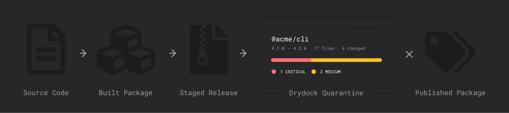

# Drydock Package Review

Drydock is pre-publish package security for maintainers. It reviews the exact npm, PyPI, or VS Code artifact before publication, compares it with a tag-aware published baseline, runs deterministic supply-chain checks, optionally sends changed-file evidence to Cloudflare Workers AI, and saves a review report.

It has two release modes with different authority. **Workflow Gate — enforced** can approve or reject the configured protected GitHub publish job. **Stage Watchtower — advisory** reviews and records npm staged artifacts, while npm maintainers independently approve or reject them and can still publish manually. Drydock never publishes and never collects npm approval codes.

Drydock runs as a hosted service at [drydock.org](https://drydock.org); this repository is its source, and it can be self-hosted on your own Cloudflare account. To add it to a release, jump to [Add Drydock to your release](#add-drydock-to-your-release).

## Use Drydock without an account

- **Read a package diff:** compare any two public npm, PyPI, or atpm releases at [drydock.org/diff](https://drydock.org/diff). Drydock parses the archives without installing or executing package code.
- **Add diffs to Renovate PRs:** extend `"github>JoviDeCroock/drydock//renovate/diff-links"` after your base presets. Every linkable npm and PyPI update gains a Drydock column.
- **Add diffs to Dependabot PRs:** copy the [verified comment workflow](https://drydock.org/docs#dependabot-diff-links). It supports grouped updates and never checks out PR code.
- **Enforce dependency policy in CI:** run [`drydock verify`](docs/verify-ci.md) to check changed npm package pairs for release age, verdict grade, capability escalations, and listed maintainer reviews.
- **Show reviewed releases:** after opting a shared review into the public feed, copy its README badge from the share dialog. The badge points readers back to verifiable review evidence.

The dependency-PR integrations add plain links, so Drydock is contacted only when a reviewer chooses to open a diff. See the [integration contract](docs/dependency-pr-diff-links.md) for version-pair guards and security details.

## Sponsored by

<a href="https://www.aikido.dev">
  <picture>
    <source media="(prefers-color-scheme: dark)" srcset="src/assets/aikido-wordmark-inverted.svg">
    
  </picture>
</a>

[Aikido Security](https://www.aikido.dev) sponsors Drydock's development. Sponsorship funds the work; it does not influence detection rules, findings, or risk scoring.



## Add Drydock to your release

**If you publish from GitHub Actions, use a workflow gate.** It is the path for npm, PyPI, and VS Code
alike, and it is what the example repositories below use. `npm stage publish` is a shortcut for npm
maintainers who already publish that way from a terminal — if you don't, skip it. Both paths produce
the same review report, but they differ in authority: the gate controls its protected job, while the
watchtower only records advice about npm's stage.

### Workflow Gate — enforced (npm, PyPI, VS Code)

CI builds the release and uploads it. A GitHub Environment pauses the publish job until you accept
the review in Drydock, then the same job publishes the exact reviewed bytes.

Enforcement is scoped to this configured protected job. For npm, trusted-publisher and token settings
can narrow automated publishing to that path, but npm still permits an account holder to publish
interactively with password, 2FA, and an OTP.

1. Sign in at [drydock.org](https://drydock.org) and create the organization that owns the release.
2. In `Organization settings → GitHub App`, install the Drydock GitHub App on the account that hosts
   the repository.
3. In the repository's `Settings → Environments`, create an environment (for example `production`)
   and enable **Drydock** as a custom deployment protection rule.
4. Back in Drydock settings, map that repository and environment to your organization.
5. Split your release workflow into a build job that uploads the artifacts and a publish job pinned
   to the protected environment:

   ```yaml
   jobs:
     pack:
       runs-on: ubuntu-latest
       steps:
         - uses: actions/checkout@v4
         - run: npm ci
         - run: npm pack --pack-destination dist
         - run: cd dist && sha256sum *.tgz > SHA256SUMS
         - uses: actions/upload-artifact@v4
           with:
             name: npm-release-candidates
             path: dist/

     publish:
       needs: pack
       environment: production # Drydock holds this job
       permissions: { id-token: write, contents: read }
       steps:
         - uses: actions/download-artifact@v4
           with: { name: npm-release-candidates, path: dist }
         - run: cd dist && sha256sum --check --strict SHA256SUMS
         - run: npm publish dist/*.tgz --access public --provenance
   ```

6. Push a release. The publish job pauses, Drydock reviews the uploaded artifacts, and accepting the
   review releases the job. Rejecting it keeps that configured protected job blocked.

There is no Drydock manifest to maintain: package name, version, and ecosystem are read from metadata
inside the uploaded `.tgz`, `.whl`, `.tar.gz`, or `.vsix`. A monorepo upload becomes one report per
package, and the job continues only once every package is accepted. The publish job must publish the
bytes it downloaded — rebuilding after approval breaks the review boundary, which is what the
`SHA256SUMS` record/check pair enforces.

Full workflows for each ecosystem: [PyPI CI example](https://github.com/JoviDeCroock/drydock-ci-example),
[npm monorepo CI example](https://github.com/JoviDeCroock/drydock-npm-monorepo-ci-example), and
[`docs/workflow-gates.md`](docs/workflow-gates.md).

### Stage Watchtower — advisory (npm only)

npm holds a private staged tarball; Drydock reviews it and you finish the publish in npm with your
own 2FA.

Drydock's decision is a review record, not an npm control: npm maintainers independently approve or
reject the stage, and manual publication remains possible.

1. Create a Drydock organization, then on npmjs.com generate a granular access token with
   `Packages and scopes: Read-only` and `Organizations: No access` covering the scopes you publish.
2. Paste it into `Organization settings → npm access`.
3. Run `npm stage publish` from the package directory. Drydock discovers the stage, scans it, and
   shows the report.
4. Record your decision in Drydock, then complete or discard the publish on npm — on npmjs.com or
   with the `npm stage approve` / `npm stage reject` command Drydock shows you.

The longer walkthrough of both paths — what the report contains, how the credential boundary works,
and per-ecosystem workflow examples — lives at [drydock.org/docs](https://drydock.org/docs).

## Docs

[drydock.org/docs](https://drydock.org/docs) is the guide for maintainers setting Drydock up. The
files below are the engineering and operator reference for working on Drydock or self-hosting it;
start with [`docs/README.md`](docs/README.md) to pick the smallest relevant one. Common entry points:

- [`docs/self-hosting.md`](docs/self-hosting.md) — local setup, Cloudflare resources, deployment, GitHub App, and Slack setup.
- [`docs/architecture.md`](docs/architecture.md) — runtime components, trust boundaries, adapters, storage, and API shape.
- [`docs/security-model.md`](docs/security-model.md) — non-negotiable security posture.
- [`docs/workflow-gates.md`](docs/workflow-gates.md) — GitHub Environment gate contract for PyPI, npm, and VS Code workflow-gated releases.
- [`docs/release-safety.md`](docs/release-safety.md), [`docs/security-detection-corpus.md`](docs/security-detection-corpus.md), [`docs/detection-eval.md`](docs/detection-eval.md), and [`docs/e2e-test-environment.md`](docs/e2e-test-environment.md) — verification and detection quality.

## Layout

```text
server/       Hono Worker, scan pipeline, adapters, persistence, webhooks
src/          Preact UI and typed API models
packages/     Published consumer tooling, including the drydock verify CLI
drizzle/      D1 migrations
docs/         Architecture, security, workflow, setup, and test references
test/         Vitest, Worker-runtime, security corpus, and fake-registry e2e
```

## Develop

Requirements: Node `22.14.0+` and pnpm `11.1.1` (pinned in `package.json`).

```sh
pnpm install
cp .dev.vars.example .dev.vars
pnpm run dev
```

The dev server runs the Worker and UI through Vite at `http://localhost:5173`. Edit `.dev.vars` with local Cloudflare, Better Auth, npm, GitHub App, Slack, and optional Workers AI/Flagship values as described in [`docs/self-hosting.md`](docs/self-hosting.md).

Useful commands:

```sh
pnpm run lint
pnpm run format:check
pnpm run typecheck
pnpm run test
pnpm run test:e2e
pnpm run verify
```

For deterministic browser testing without real staged publishes, use the local fake-registry harness in [`docs/e2e-test-environment.md`](docs/e2e-test-environment.md). For an agent-readable product walkthrough, use [`docs/agent-tour.md`](docs/agent-tour.md).

## Configuration

The checked-in `wrangler.jsonc` describes the maintainers' deployment. Self-hosters copy
`docs/examples/wrangler.self-host.jsonc` to the gitignored `wrangler.self-host.jsonc`, pass it explicitly to
Vite, migrations, and secret commands, then deploy the config generated by the Vite build. See
[`docs/self-hosting.md`](docs/self-hosting.md) for the complete flow.

Core Cloudflare bindings are D1 (`DB`), the Dynamic Worker loader (`LOADER`), and Workers AI
(`AI`). Queue (`SCAN_QUEUE`), R2 (`ARTIFACTS`), KV (`COMPARE_CACHE`), Flagship (`FLAGS`),
Analytics Engine (`PRODUCT_ANALYTICS`), email (`SEND_EMAIL`), and static assets (`ASSETS`) support
the corresponding optional or deployed features.

Important secrets/vars:

- `BETTER_AUTH_SECRET`, `BETTER_AUTH_URL`
- `NPM_CONNECTIONS_ENCRYPTION_KEY`
- `GITHUB_APP_ID`, `GITHUB_APP_SLUG`, `GITHUB_APP_CLIENT_ID`,
  `GITHUB_APP_CLIENT_SECRET`, `GITHUB_APP_PRIVATE_KEY`, `GITHUB_APP_WEBHOOK_SECRET`, and optional
  `GITHUB_APP_STATE_SECRET`
- `SLACK_CLIENT_ID`, `SLACK_CLIENT_SECRET`

Run `pnpm run cf-typegen` after changing Cloudflare bindings.

## API surface

The authenticated JSON API lives under `/api/v1`. The main resources are:

- scans: create/list/read/export reports, compare published baselines, and fetch prior file samples;
- npm connection: read public metadata, store/rotate, validate, and remove the current organization token;
- release targets and workflow gates: map GitHub repositories/environments, review queued gate artifacts, and post accept/reject decisions;
- auth/org/settings helpers for Better Auth-backed sessions and organization membership.

Consult route definitions under `server/routes/` for exact request/response shapes; shared types are imported by the UI from `server/`.

## Security posture

- Package artifacts are untrusted evidence and are never executed.
- npm credentials are encrypted at rest, decrypted only for registry access, and never passed into the Dynamic Worker sandbox.
- The sandbox can fetch only through constrained brokers/gateways and returns bounded metadata/text evidence.
- AI review is advisory and on by default behind the `ai-review` killswitch, and cannot downgrade deterministic findings.
- Raw tarballs are not retained by default; persisted reports use redacted summaries and canonical report JSON.

See [`docs/security-model.md`](docs/security-model.md) for the full contract.

## License

Drydock is open-source software released under the [Apache License 2.0](LICENSE.md).
